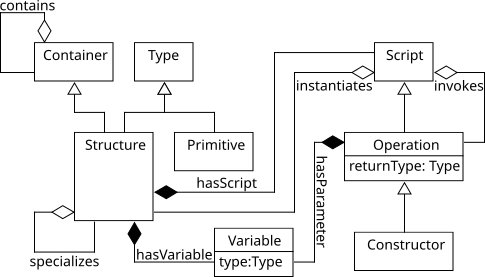
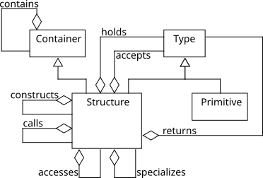
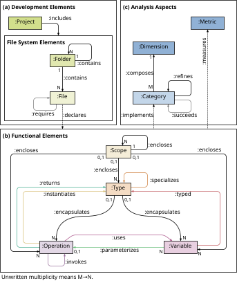

# javapers

A knowledge graph extractor for Java projects.

`javapers` parses one or more Java source roots and produces a labelled property graph (LPG) that you can consume from downstream tools (e.g., visualisation, analysis, querying).

## What it outputs

`javapers` can output graphs in two schema families:

- **SABO 2 (default)** — the current schema (schemaVersion = `2.0`)
- **SABO 1 (legacy)** — the old schema family (schemaVersion = `1.2.0`), enabled via `-1/--version-1`

The output format can be **CSV** or **JSON** (`-f/--format`).

## SABO 1 (legacy schemas)

These are the schemas previously documented and illustrated in this repository. They are still supported for compatibility, but **are no longer the default**.

1. **Detailed (SABO 1)**

   

2. **Abstract (SABO 1)**

   

> Note: The SABO 1 legacy mode uses the older naming conventions (e.g., Containers / Structures rather than Scopes / Types).

To force SABO 1 output, use `-1` / `--version-1`.

## SABO 2 (current schema)

SABO 2 is the default output schema (schemaVersion = `2.0`). It generalises the representation and introduces additional structure and analysis integration.



### Included analysis (SABO 2)

When using SABO 2 (default), `javapers` additionally computes **Halstead metrics** and integrates them into the graph:

- A node with id `Metrics#HalsteadMetrics` (label: `Metric`)
- Edges from code elements to the metric node (label: `measures`)
- Metric values attached as edge properties

This is *not* produced in SABO 1 legacy mode.

---

## Usage

```shell
$ java -jar javapers.jar <args>
````

### Arguments

| Argument       | Aliases       | Description                                                                                         | Default       |
| -------------- | ------------- | --------------------------------------------------------------------------------------------------- | ------------- |
| `-i INFILE`    | `--input`     | Input path(s). If you provide multiple paths, they are split using `-s` (default separator is `+`). | `.`           |
| `-o OUTFILE`   | `--output`    | Output directory.                                                                                   | `.`           |
| `-f FORMAT`    | `--format`    | Output format: `json` or `csv`.                                                                     | `csv`         |
| `-n BASE_NAME` | `--name`      | Base output file name (e.g., `BASE_NAME.json` / `BASE_NAME.csv`).                                   | `JavaProject` |
| `-s SEPARATOR` | `--separator` | Separator for splitting input paths provided via `-i`.                                              | `+`           |
| `-1`           | `--version-1` | Use SABO 1 legacy schema output (Containers/Structures naming).                                     | off           |
| `-a`           | `--stdout`    | Print the encoded graph to stdout. *(Note: current behavior still writes files to `-o` as well.)*   | off           |

### Examples

#### 1) Extract a single project (default SABO 2, CSV)

```shell
java -jar javapers.jar -i . -o out
```

#### 2) Extract multiple source roots (default separator `+`)

```shell
java -jar javapers.jar -i "moduleA/src+moduleB/src" -o out -n MyProject
```

If you prefer another separator:

```shell
java -jar javapers.jar -s "," -i "moduleA/src,moduleB/src" -o out
```

#### 3) JSON output

```shell
java -jar javapers.jar -i . -o out -f json -n MyProject
```

#### 4) Force SABO 1 legacy schema

```shell
java -jar javapers.jar -i . -o out -1
```

#### 5) Print to stdout (also writes files)

```shell
java -jar javapers.jar -i . -o out -f json -a
```

---

## Showcase

Consult the `sample_output` directory to get a feel of what the resulting knowledge graph looks like.

Check out [classviz](https://github.com/rsatrioadi/classviz), a project that uses an output of javapers as input for visualizing class relationships. Historically, it has been used with the JSON output of the abstract (SABO 1) schema.

You can play around with the JHotDraw example [here](https://rsatrioadi.github.io/classviz/?p=jhotdraw_abstract).

---

## Citing

```bibtex
@software{rukmono2023javapers,
  author       = {Satrio Adi Rukmono},
  title        = {rsatrioadi/javapers: javapers 1.0},
  month        = jan,
  year         = 2023,
  publisher    = {Zenodo},
  version      = {v1.0},
  doi          = {10.5281/zenodo.7568438},
  url          = {https://doi.org/10.5281/zenodo.7568438}
}
```
